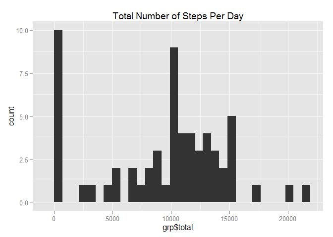
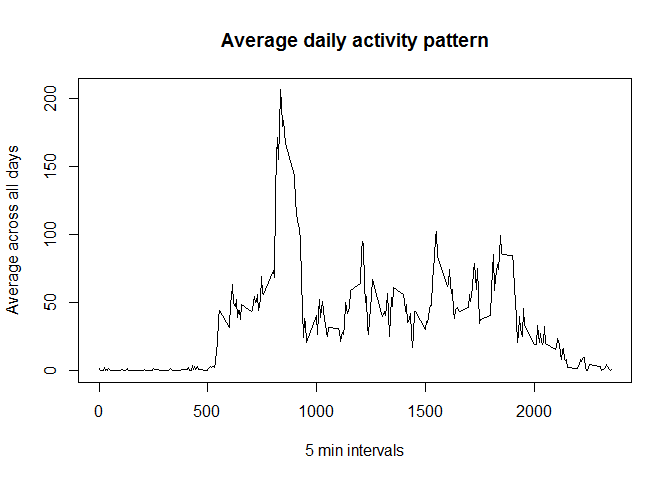
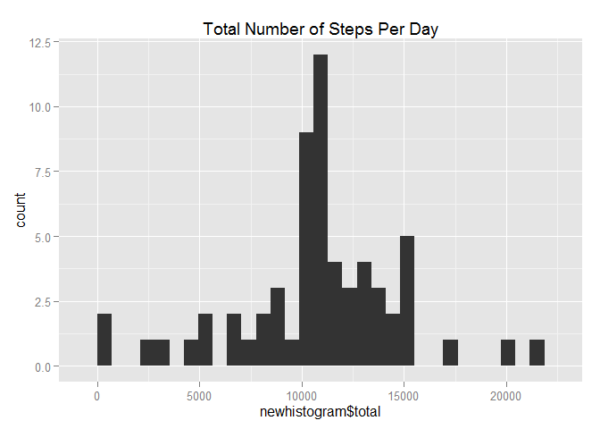
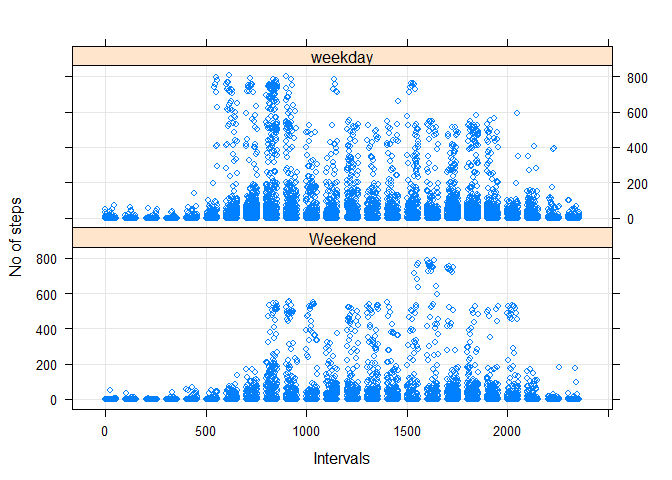
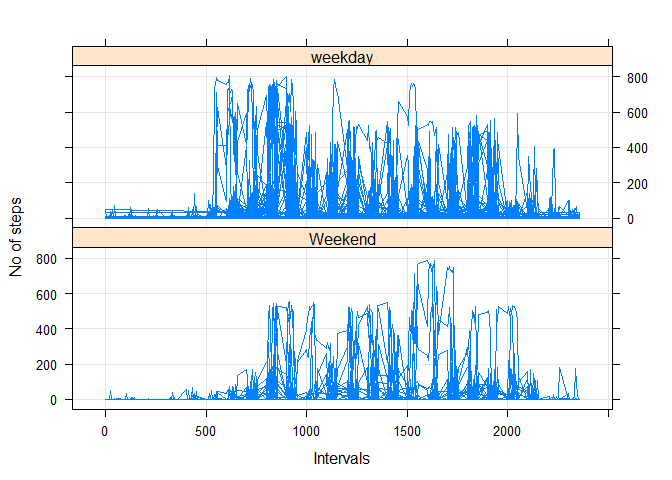

# Reproducible Research: Peer Assessment 1


## Loading and preprocessing the data


###load data
 The First real task is the unzip the data and load it into R
 

```r
unzip("activity.zip")
data <- read.csv("activity.csv", stringsAsFactors = FALSE)
```
 
## What is mean total number of steps taken per day?

### **Mean ** Total number of steps taken per day
  We will use the plyr and dplyr  package to work with our data. The plyr package must be loaded first.
  

```r
library(plyr)
library(dplyr)
```

```
## 
## Attaching package: 'dplyr'
## 
## The following objects are masked from 'package:plyr':
## 
##     arrange, count, desc, failwith, id, mutate, rename, summarise,
##     summarize
## 
## The following objects are masked from 'package:stats':
## 
##     filter, lag
## 
## The following objects are masked from 'package:base':
## 
##     intersect, setdiff, setequal, union
```

```r
grp <- group_by(data,date) %>%
  summarize( total = sum(steps, na.rm=TRUE), nosteps = mean(steps,na.rm=TRUE) )
grp
```

```
## Source: local data frame [61 x 3]
## 
##          date total  nosteps
##         (chr) (int)    (dbl)
## 1  2012-10-01     0      NaN
## 2  2012-10-02   126  0.43750
## 3  2012-10-03 11352 39.41667
## 4  2012-10-04 12116 42.06944
## 5  2012-10-05 13294 46.15972
## 6  2012-10-06 15420 53.54167
## 7  2012-10-07 11015 38.24653
## 8  2012-10-08     0      NaN
## 9  2012-10-09 12811 44.48264
## 10 2012-10-10  9900 34.37500
## ..        ...   ...      ...
```


### Make a histogram of the number of steps taken each day
  View a Histogram of the steps taken.
  

```r
library(ggplot2)
qplot(grp$total, geom="histogram",main="Total Number of Steps Per Day")
```

```
## stat_bin: binwidth defaulted to range/30. Use 'binwidth = x' to adjust this.
```

 
  


### Calculate the mean and the median 
This is a calcuation on the number of steps taken per day


```r
mean_num_of_steps <- mean(x = grp$total, na.rm = TRUE)
median_num_of_steps <- median(x= grp$total, na.rm = TRUE)
```

We find that the mean is 9354.2295082     while the the median is found to be 10395


## What is the average daily activity pattern?


```r
tm <- group_by(data,interval) %>%
  summarize(average = mean(steps,na.rm = TRUE), countsteps = sum(steps,na.rm=TRUE))

plot.ts(x = tm$interval, y=tm$average,type = "l", xlab = "5 min intervals", ylab = "Average across all days", main="Average daily activity pattern")
```

 
  
The 5-minute interval across all days that contains the maximum number of steps is: 835

The number of missings values in the dataset is: 2304

```r
missing_NA_in_data <- sum(is.na(data$steps))
```


## Imputing missing values
We will use the mean of all steps accross all the weeks to apply to NA values in the dataset


```r
# change interval type to factor
data$interval <- as.factor(data$interval)


fn_mean <- function(x){
  replace(x, is.na(x), mean(x,na.rm=TRUE))
}
newdata <- ddply(data, .(interval), transform,steps = fn_mean(steps))
 
head(newdata,30)
```

```
##        steps       date interval
## 1   1.716981 2012-10-01        0
## 2   0.000000 2012-10-02        0
## 3   0.000000 2012-10-03        0
## 4  47.000000 2012-10-04        0
## 5   0.000000 2012-10-05        0
## 6   0.000000 2012-10-06        0
## 7   0.000000 2012-10-07        0
## 8   1.716981 2012-10-08        0
## 9   0.000000 2012-10-09        0
## 10 34.000000 2012-10-10        0
## 11  0.000000 2012-10-11        0
## 12  0.000000 2012-10-12        0
## 13  0.000000 2012-10-13        0
## 14  0.000000 2012-10-14        0
## 15  0.000000 2012-10-15        0
## 16  0.000000 2012-10-16        0
## 17  0.000000 2012-10-17        0
## 18  0.000000 2012-10-18        0
## 19  0.000000 2012-10-19        0
## 20  0.000000 2012-10-20        0
## 21  0.000000 2012-10-21        0
## 22 10.000000 2012-10-22        0
## 23  0.000000 2012-10-23        0
## 24  0.000000 2012-10-24        0
## 25  0.000000 2012-10-25        0
## 26  0.000000 2012-10-26        0
## 27  0.000000 2012-10-27        0
## 28  0.000000 2012-10-28        0
## 29  0.000000 2012-10-29        0
## 30  0.000000 2012-10-30        0
```


Here is a histogram of the dataset

```r
newdata$interval <- as.character(newdata$interval)

newhistogram <- group_by(newdata,date) %>%
             summarise(total = sum(steps) )

#Historgram
qplot(newhistogram$total, geom="histogram",main="Total Number of Steps Per Day")
```

```
## stat_bin: binwidth defaulted to range/30. Use 'binwidth = x' to adjust this.
```

 

### central tendency

* Mean   : 1.0766189\times 10^{4}
* Median : 1.0766189\times 10^{4}

The histogram differs from the first on on the zero x axis.  Those values are now located to the respective interval sections.

* Total With NAs:  570608
* Total without NAs: 6.5673751\times 10^{5}


## Are there differences in activity patterns between weekdays and weekends?

For this section we will need to install a package *install.packages("chron")*  this is not place in the code area, as this would affect the performance when developing this document.  


```r
#install.packages("chron")
library(chron)
newhistogram$date <- as.character.Date(newhistogram$date)


newdata$interval <- as.integer(newdata$interval);

wkdays <-  newdata %>% transform(daytype = factor(chron::is.weekend(date),levels=c(TRUE,FALSE), 
                   labels=c("Weekend","weekday")))

head(wkdays,30)
```

```
##        steps       date interval daytype
## 1   1.716981 2012-10-01        0 weekday
## 2   0.000000 2012-10-02        0 weekday
## 3   0.000000 2012-10-03        0 weekday
## 4  47.000000 2012-10-04        0 weekday
## 5   0.000000 2012-10-05        0 weekday
## 6   0.000000 2012-10-06        0 Weekend
## 7   0.000000 2012-10-07        0 Weekend
## 8   1.716981 2012-10-08        0 weekday
## 9   0.000000 2012-10-09        0 weekday
## 10 34.000000 2012-10-10        0 weekday
## 11  0.000000 2012-10-11        0 weekday
## 12  0.000000 2012-10-12        0 weekday
## 13  0.000000 2012-10-13        0 Weekend
## 14  0.000000 2012-10-14        0 Weekend
## 15  0.000000 2012-10-15        0 weekday
## 16  0.000000 2012-10-16        0 weekday
## 17  0.000000 2012-10-17        0 weekday
## 18  0.000000 2012-10-18        0 weekday
## 19  0.000000 2012-10-19        0 weekday
## 20  0.000000 2012-10-20        0 Weekend
## 21  0.000000 2012-10-21        0 Weekend
## 22 10.000000 2012-10-22        0 weekday
## 23  0.000000 2012-10-23        0 weekday
## 24  0.000000 2012-10-24        0 weekday
## 25  0.000000 2012-10-25        0 weekday
## 26  0.000000 2012-10-26        0 weekday
## 27  0.000000 2012-10-27        0 Weekend
## 28  0.000000 2012-10-28        0 Weekend
## 29  0.000000 2012-10-29        0 weekday
## 30  0.000000 2012-10-30        0 weekday
```

## Panel Plot

For whatever reason the _type = "l"_ attribute produces odd results and was not includes

```r
library(lattice)

wkdays <-  newdata %>% transform(daytype = factor(chron::is.weekend(date),levels=c(TRUE,FALSE), 
                   labels=c("Weekend","weekday"))) %>%
                   arrange(interval,date)  %>%
                   ddply( c("date","interval","daytype"), summarise, arvsteps = mean(steps))

wkdays$arvsteps <- as.integer(wkdays$arvsteps);
head(wkdays,30)
```

```
##          date interval daytype arvsteps
## 1  2012-10-01        0 weekday        1
## 2  2012-10-01        5 weekday        0
## 3  2012-10-01       10 weekday        0
## 4  2012-10-01       15 weekday        0
## 5  2012-10-01       20 weekday        0
## 6  2012-10-01       25 weekday        2
## 7  2012-10-01       30 weekday        0
## 8  2012-10-01       35 weekday        0
## 9  2012-10-01       40 weekday        0
## 10 2012-10-01       45 weekday        1
## 11 2012-10-01       50 weekday        0
## 12 2012-10-01       55 weekday        0
## 13 2012-10-01      100 weekday        0
## 14 2012-10-01      105 weekday        0
## 15 2012-10-01      110 weekday        0
## 16 2012-10-01      115 weekday        0
## 17 2012-10-01      120 weekday        0
## 18 2012-10-01      125 weekday        1
## 19 2012-10-01      130 weekday        1
## 20 2012-10-01      135 weekday        0
## 21 2012-10-01      140 weekday        0
## 22 2012-10-01      145 weekday        0
## 23 2012-10-01      150 weekday        0
## 24 2012-10-01      155 weekday        0
## 25 2012-10-01      200 weekday        0
## 26 2012-10-01      205 weekday        0
## 27 2012-10-01      210 weekday        1
## 28 2012-10-01      215 weekday        0
## 29 2012-10-01      220 weekday        0
## 30 2012-10-01      225 weekday        0
```

```r
#Create plot
xyplot(arvsteps ~ interval | daytype, data=wkdays, grid = TRUE,  layout = c(1,2),  xlab = "Intervals", ylab = "No of steps"  )
```

 

With _type = "l"_ included!


```r
library(lattice)

wkdays <-  newdata %>% transform(daytype = factor(chron::is.weekend(date),levels=c(TRUE,FALSE), 
                   labels=c("Weekend","weekday"))) %>%
                   arrange(interval,date)  %>%
                   ddply( c("date","interval","daytype"), summarise, arvsteps = mean(steps))

wkdays$arvsteps <- as.integer(wkdays$arvsteps);
head(wkdays,30)
```

```
##          date interval daytype arvsteps
## 1  2012-10-01        0 weekday        1
## 2  2012-10-01        5 weekday        0
## 3  2012-10-01       10 weekday        0
## 4  2012-10-01       15 weekday        0
## 5  2012-10-01       20 weekday        0
## 6  2012-10-01       25 weekday        2
## 7  2012-10-01       30 weekday        0
## 8  2012-10-01       35 weekday        0
## 9  2012-10-01       40 weekday        0
## 10 2012-10-01       45 weekday        1
## 11 2012-10-01       50 weekday        0
## 12 2012-10-01       55 weekday        0
## 13 2012-10-01      100 weekday        0
## 14 2012-10-01      105 weekday        0
## 15 2012-10-01      110 weekday        0
## 16 2012-10-01      115 weekday        0
## 17 2012-10-01      120 weekday        0
## 18 2012-10-01      125 weekday        1
## 19 2012-10-01      130 weekday        1
## 20 2012-10-01      135 weekday        0
## 21 2012-10-01      140 weekday        0
## 22 2012-10-01      145 weekday        0
## 23 2012-10-01      150 weekday        0
## 24 2012-10-01      155 weekday        0
## 25 2012-10-01      200 weekday        0
## 26 2012-10-01      205 weekday        0
## 27 2012-10-01      210 weekday        1
## 28 2012-10-01      215 weekday        0
## 29 2012-10-01      220 weekday        0
## 30 2012-10-01      225 weekday        0
```

```r
#Create plot
xyplot(arvsteps ~ interval | daytype, data=wkdays, grid = TRUE, type="l",  layout = c(1,2),  xlab = "Intervals", ylab = "No of steps"  )
```

 

